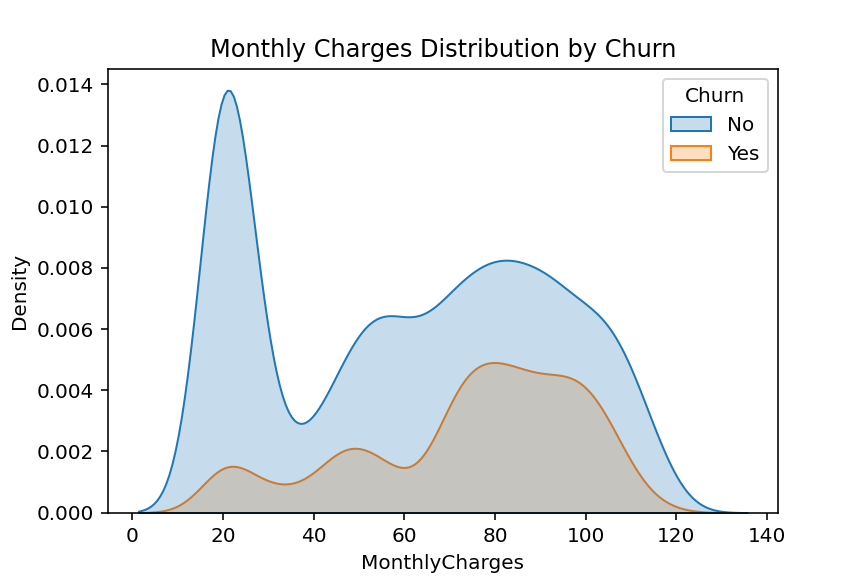

# Telecom Customer Churn Prediction

This project aims to predict customer churn in the telecommunications sector using machine learning techniques. By analyzing customer behavior, usage patterns, and demographic information, we develop models to forecast which customers are likely to leave the service. This can help companies implement proactive retention strategies.

## Dataset

We use the [Telco Customer Churn Dataset](https://www.kaggle.com/blastchar/telco-customer-churn) from Kaggle, which contains detailed customer information such as contract type, tenure, monthly charges, and churn status.

## Features

- Customer demographics (gender, age, etc.)
- Account information (contract type, payment method)
- Service usage (internet service, phone service)
- Billing information (monthly charges, total charges)
- Customer support calls

## Methodology

1. Data cleaning and preprocessing  
2. Exploratory data analysis (EDA)  
3. Feature engineering  
4. Model training with algorithms like Random Forest, XGBoost  
5. Model evaluation using accuracy, precision, recall, F1-score  
6. Hyperparameter tuning and optimization  

## Usage

Instructions to run the notebook and reproduce results.

## Results

Summary of model performance and insights.

## Future Work

- Testing with deep learning models  
- Deployment as a web service or API  
- Incorporating real-time data streams  

## License

MIT License
# Telecom Customer Churn Prediction
# Telecom Customer Churn Prediction

This project analyzes customer churn data from a telecom company using machine learning.  
The goal is to predict which customers are likely to leave the service.

## Data Visualization

### Churn Distribution  


### Gender vs Churn  


### Monthly Charges Distribution  


### Correlation Matrix  


## Models and Results

### Logistic Regression

- Accuracy: 81.6%  
- F1-score (churn class): 62%

### XGBoost

- Accuracy: 78.6%  
- F1-score (churn class): 57%

## How to Run

Make sure you have installed the requirements:

```bash
pip install -r requirements.txt

